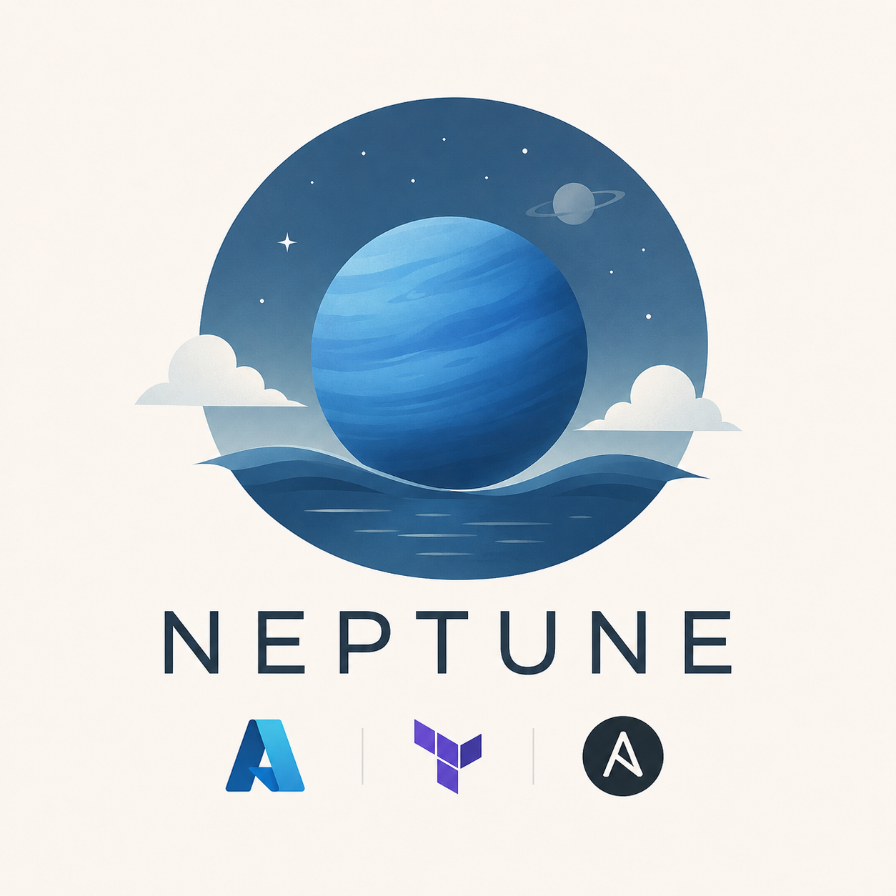

# Neptune

## Project Description
`Neptune is an Azure-based project that uses terraform for deployment and hosts an Artifactory Docker container repository.`

## Technologies Used
- Terraform
- Ansible
- Jfrog Artifactory (JCR)
- Microsoft Azure

## Requirements
- Create or Sign into Azure Account
- Install Azure CLI ([Installation Instructions](https://learn.microsoft.com/en-us/cli/azure/install-azure-cli?view=azure-cli-latest))
- Install Terraform ([Installation Instructions](https://developer.hashicorp.com/terraform/tutorials/aws-get-started/install-cli))
- Install Ansible ([Installation Instructions](https://docs.ansible.com/projects/ansible/latest/installation_guide/intro_installation.html))

## Setup
1. Sign in to your azure account
2. create azure neptune project invoice section ([Instructions](https://learn.microsoft.com/en-us/azure/cost-management-billing/manage/mca-section-invoice#create-a-new-invoice-section))
    - This is useful in keeping all billing line items for the project organized
3. Login to account from Azure CLI
    - Use the command `az login` and follow the prompts
4. Set Terraform variables in example file (`terraform.tfvars.example`)
**Optional variables have been commented out in the example file, as they do not need to be set**

    - subscription_id **(Required)** : This is the id of the Azure subscription the created project will be attached to. Run `az account list --output table` and copy the `SubscriptionId` of the subscription you are using for this project.
    - linux_admin **(Optional)** : The name of the linux administrator account create on the Azure VMs. Defaults to `neptune-admin`.
    - vn_cidr_block **(Optional)** : The CIDR block that the Azure Virtual Network will use. Defaults to `10.0.0.0/16`.
    - artifactory_subnet_cidr_block **(Optional)** : The CIDR block that the Virtual Machine running Artifactory uses. Defaults to `10.0.1.0/24` .
    - artifactory_db_subnet_cidr_block **(Optional)** : The CIDR block that the Azure Database for PostgreSQL Flexible Server database used by Artifactory uses. Defaults to `10.0.2.0/24`. **IMPORTANT: This CIDR block must ONLY be used by the Azure Database for PostgreSQL Flexible Server database. DO NOT USE THIS CIDR BLOCK FOR ANYTHING ELSE.**
    - psql_admin **(Optional)** : The name that will be used for the administrator account on the database. Defaults to `neptune`
    - psql_password **(Required)** : The administrator password for the database.  
    **IMPORTANT: Choose a password that has a minimum of 8 characters and a maximum of 128 characters. The password** **must contain characters from three of the following categories:**

        - **English uppercase letters**
        - **English lowercase letters**
        - **Numbers**
        - **Non-alphanumeric characters**
    - my_ip_cidr **(Optional)** : The IP address of the machine you will use to access the applications that are deployed. By default terraform will try to find your current IP address automatically.
    - project_path **(Optional)** : The path to the root folder of this project. Defaults to `~/Desktop/neptune`.

5. Rename `terraform.tfvars.example` to `terraform.tfvars`

6. Run `terraform apply` and respond to the prompt `Do you want to perform these actions?` with `yes`

7. Wait for terraform to provision and the ansible script to complete (Usually takes around 6 minutes)

8. Use the IP Address found in `neptune > ansible > hosts` under the `[artifactory]` section to access the vm on port 8082 (e.g. 10.0.1.4:8082) in a browser to access Artifactory.

9. Complete the initial Artifactory setup.
   **IMPORTANT: The Default username is `admin` and the default password is `password`. MAKE SURE THE DEFAULT PASSWORD IS CHANGED WHEN PROMPTED IN THE INITIAL SETUP.**

10. You now have a Docker container repository that only you can access!
